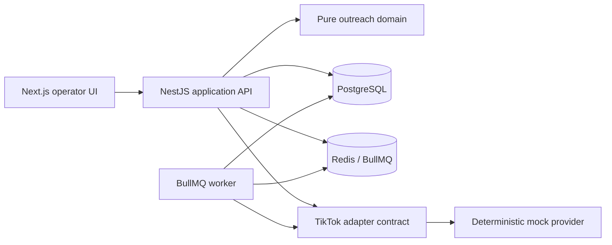

# Architecture and safety

## Component boundaries

The domain package owns filtering, ranking, cooldown decisions, deduplication, template rendering, safety assertions, and reconciliation matching. The API owns operator workflows and persistence. The worker owns dispatch state transitions. Discovery receives only `searchCreators`, history receives only `listConversations` and `listMessages`, and the outbound worker receives only `createOrGetConversation` and `sendMessage`.

## Campaign lifecycle

1. Create a draft with target, filters, cooldown, ranking, product, and message template.
2. Page through creator discovery using a stable search key and page token.
3. Apply local filters and canonicalize by `creator_open_id`.
4. Exclude do-not-contact, unresolved delivery, active reservation, and cooldown contacts, including historical imports.
5. Rank eligible creators and select `min(requested, eligible)` without changing filters.
6. Persist the preview and exclusion counts.
7. Freeze the selection, render and store the exact message per recipient, hash it, and reserve each creator.
8. Require the current campaign version, exact campaign name, and exact selected count before enqueueing.
9. Dispatch through BullMQ. PostgreSQL records a dispatch slot before every provider attempt.

Frozen previews expire after 30 minutes, move to `PREVIEW_EXPIRED`, and release reservations idempotently. Freeze re-checks current contact state, cooldown, unknown deliveries, do-not-contact, and active reservations under ordered per-shop/per-creator transaction locks shared by history and delivery mutations. If every selected creator became ineligible, freeze returns the campaign to `PREVIEW_EXPIRED` immediately without an active expiry window. A unique `(campaign_id, creator_id)` recipient and unique `(shop_id, creator_id)` active reservation prevent duplicate selection.

Campaign recipient capacity (`maxRecipientsPerCampaign`) and provider dispatch-attempt capacity (`maxDispatchAttemptsPerCampaign`) are independent. Daily, hourly, and rolling-minute claims remain separate. A persistent per-shop lease allows one active mutation sequence, and `outboundPacingMs` spaces starts. Reaching the campaign attempt ceiling moves the campaign to `SAFETY_PAUSED`; it does not create an infinite delayed-job loop.

PostgreSQL is the queue source of truth. Campaign start commits each delivery and its `QueueOutbox` intent atomically. API and worker sweepers reconcile every safe `QUEUED` recipient to a deterministic BullMQ job after partial Redis failures or restarts. Queue presence never marks a delivery sent.

## Persistent data

The Prisma schema separates shops and integration modes, creator identity, metric snapshots, shop-specific contact state, conversations and messages, resumable paged history sync/import runs, cross-file historical contact facts, campaigns and frozen recipients, reservations, durable queue intents, deliveries and attempts, reconciliation evidence, dispatch events, daily usage, and audit events.

Safety values from environment variables are used only when the mock Shop is first created. Persistent Shop columns are authoritative at runtime thereafter, and `SafetySettingsAudit` records initialization and provides the audit trail required for future setting changes.

PostgreSQL stores the exact frozen outbound message and content hash. Runtime logs include only operational IDs, provider-safe error codes, and error summaries; they do not log message bodies, access tokens, app secrets, or request signatures.

## Safety invariants

- `APP_MODE` validates only to `mock` or `read_only`. `OUTBOUND_MODE` independently validates to `mock`, `read_only`, or `live`.
- Live capability requires `APP_MODE=read_only`, `OUTBOUND_MODE=live`, and the exact acknowledgement `ENABLE_LIVE_TIKTOK_OUTBOUND=I_UNDERSTAND_THIS_SENDS_REAL_MESSAGES`; otherwise it fails closed.
- The real read-only adapter still accepts only its exact read allowlist. The separate outbound adapter accepts only Create Conversation and Send Message; Mark Read is absent.
- A dispatch is counted before the mock provider is called.
- Campaign, Indonesia shop-day, and rolling-minute ceilings are enforced under a PostgreSQL advisory lock and serializable transaction.
- PostgreSQL is authoritative for the maximum permitted dispatch rate. BullMQ also has an environment-configured infrastructure limiter, which may operate more slowly but can never override the database ceiling.
- Explicit non-acceptance outcomes may retry with exponential backoff. Each retry consumes a new dispatch event and safety budget.
- A timeout or crash after dispatch becomes `DELIVERY_UNKNOWN` and is never sent again.
- Reconciliation is read-only. One unique outbound message with the same conversation, content hash, and timing window marks the delivery sent. No match or multiple matches remain blocked after the final check.
- Contact cooldown is updated only after a confirmed send or positively reconciled send.
- Immediately before a dispatch claim, the worker re-checks do-not-contact, unrelated unresolved deliveries, reservation ownership, campaign state, and external cooldown changes. Unsafe recipients are cancelled and audited without consuming an attempt.
- Pause is cooperative: active database transitions finish, queued jobs delay, and resume re-enqueues only safe states.

## Historical-contact capability

Exact Creator Open IDs make every confirmed app-originated send dedupe/cooldown safe. Unresolved IM-only historical identities never produce a heuristic match and do not block all outbound; the API and UI report `HISTORICAL_COOLDOWN_COVERAGE_INCOMPLETE` separately from `APP_ORIGINATED_DEDUPE_SAFE`.

## Extension points

Add future modules as new API modules, UI route groups, domain services, and queue names. Creator identity, shop contact state, conversations, and audit events are shared foundations; leads, clip delivery, attribution, and workflow monitoring should not be added to the outreach worker.
# Resumable Marketplace discovery

Real TikTok Marketplace discovery is a persistent read-only workflow. The API creates one `DiscoveryRun` per campaign and returns immediately. A dedicated discovery process claims due runs in PostgreSQL, performs at most one `SEARCH_CREATORS` page per step, persists exact-Open-ID staging rows and opaque pagination state, then schedules the next page. The process has no outreach queue and receives only the adapter's `searchCreators` capability.

`providerSearchKey` and `providerNextPageToken` live only on `DiscoveryRun`; campaign responses project a sanitized discovery status. `ProviderReadThrottle` provides a separate per-shop `SEARCH_CREATORS` lane with one in-flight request, at least 1,000 ms post-success spacing, and durable adaptive cooldown. Conversation and message-history reads use a distinct history lane.

Provider throttles are resumable. Marketplace 36009002/HTTP 429 uses 15/30/60/120 minute exponential cooldown with 0–20% bounded jitter and a six-hour cap, while valid `Retry-After` is a lower bound. Daily quota 45101004 waits until the next shop-local day plus five minutes. Terminal authorization, permission, signature, and shop-context failures require operator action.
