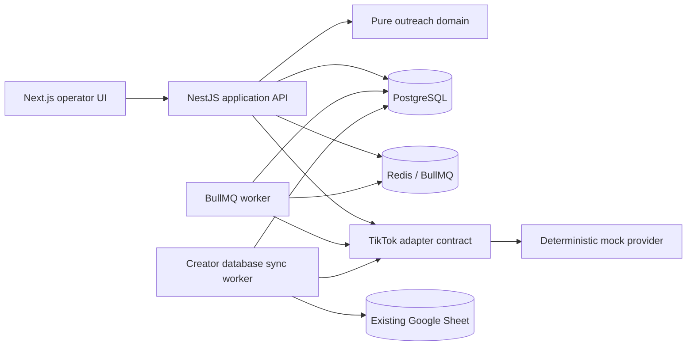

# Architecture and safety

## Component boundaries

The domain package owns filtering, ranking, cooldown decisions, deduplication, template rendering, safety assertions, and reconciliation matching. The API owns operator workflows and persistence. The creator sync worker alone receives `searchCreators`; Outreach campaign filtering reads PostgreSQL and makes no Marketplace request. History receives only `listConversations` and `listMessages`, and the outbound worker receives only `createOrGetConversation` and `sendMessage`.

## Campaign lifecycle

1. Create a draft with target, filters, cooldown, ranking, product, and message template.
2. Read the shop's latest stored Creator Database snapshots.
3. Apply filters and canonicalize by `creator_open_id` without a TikTok call.
4. Exclude do-not-contact, unresolved delivery, active reservation, and cooldown contacts, including historical imports.
5. Rank eligible creators and select `min(requested, eligible)` without changing filters.
6. Persist the preview and exclusion counts.
7. Freeze the selection, render and store the exact message per recipient, hash it, and reserve each creator.
8. A single Send action verifies the current campaign version, freezes the selection, and materializes the delivery/outbox intents before enqueueing.
9. Dispatch through BullMQ. PostgreSQL records a dispatch slot before every provider attempt.

Frozen previews expire after 30 minutes, move to `PREVIEW_EXPIRED`, and release reservations idempotently. Freeze re-checks current contact state, cooldown, unknown deliveries, do-not-contact, and active reservations under ordered per-shop/per-creator transaction locks shared by history and delivery mutations. If every selected creator became ineligible, freeze returns the campaign to `PREVIEW_EXPIRED` immediately without an active expiry window. A unique `(campaign_id, creator_id)` recipient and unique `(shop_id, creator_id)` active reservation prevent duplicate selection.

Campaign recipient capacity (`maxRecipientsPerCampaign`) limits how many distinct frozen recipients a campaign may process. Campaign dispatch counts, per-shop daily usage, and rolling provider events remain durable observability counters. Transient provider retries do not change recipient capacity. Send Message has a deliberate durable App × Shop admission interval of at least 1,000ms; provider cooldowns layer on top and are never followed by catch-up bursts.

Outbound provider capacity is isolated by TikTok App × Shop × mutation endpoint. Durable short-lived permits coordinate all worker processes. Each endpoint starts at a conservative effective concurrency, increases additively after healthy provider responses, halves on each HTTP 429 or business code `36009002`, honors `Retry-After`, and otherwise applies exponential backoff with jitter. A 16-job worker/provider ceiling protects the measured Prisma transaction pool, Node, PostgreSQL, and Redis; it is a configurable technical maximum rather than a claimed TikTok quota. Shop IM quota code `16030002` persists `QUOTA_BLOCKED` and safety-pauses affected campaigns until an operator retries after checking provider recovery.

PostgreSQL is the queue source of truth. The one-click Send action commits each delivery and its `QueueOutbox` intent atomically. API and worker sweepers reconcile every safe `QUEUED` recipient to a deterministic BullMQ job after partial Redis failures or restarts. Queue presence never marks a delivery sent.

## Persistent data

The Prisma schema separates shops and integration modes, creator identity, shop-scoped metric snapshots, durable Creator Database continuation jobs and staged pages, shop-specific contact state, conversations and messages, resumable paged history sync/import runs, cross-file historical contact facts, campaigns and frozen recipients, reservations, durable queue intents, deliveries and attempts, reconciliation evidence, dispatch events, daily usage, and audit events.

Safety values from environment variables are used only when the mock Shop is first created. Persistent Shop columns are authoritative at runtime thereafter, and `SafetySettingsAudit` records initialization and provides the audit trail required for future setting changes.

PostgreSQL stores the exact frozen outbound message and content hash. Runtime logs include only operational IDs, provider-safe error codes, and error summaries; they do not log message bodies, access tokens, app secrets, or request signatures.

## Safety invariants

- `APP_MODE` validates only to `mock` or `read_only`. `OUTBOUND_MODE` independently validates to `mock`, `read_only`, or `live`; production is required to use `live`.
- The production API and outbound worker share the same `OUTBOUND_MODE=live` configuration. The API also requires a fresh outbound-worker heartbeat with matching `mutationCapability` before accepting new Send actions.
- The real read-only adapter still accepts only its exact read allowlist. The separate outbound adapter accepts only Create Conversation and Send Message; Mark Read is absent.
- A dispatch is counted before the mock provider is called.
- Campaign recipient capacity is enforced by the persisted shop ceiling; daily/hourly/minute dispatch counters are observability only and do not block accepted sending.
- PostgreSQL is authoritative for endpoint-scoped provider permits and cooldowns. BullMQ has no messaging rate limiter; its worker concurrency is only the configurable technical scheduler ceiling.
- Explicit non-acceptance outcomes may retry with exponential backoff. Each retry consumes a new dispatch event and safety budget.
- A timeout or crash after dispatch becomes `DELIVERY_UNKNOWN` and is never sent again.
- Reconciliation is read-only. One unique outbound message with the same conversation, content hash, and timing window marks the delivery sent. No match or multiple matches remain blocked after the final check.
- Contact cooldown is updated only after a confirmed send or positively reconciled send.
- Immediately before a dispatch claim, the worker re-checks do-not-contact, unrelated unresolved deliveries, reservation ownership, campaign state, and external cooldown changes. Unsafe recipients are cancelled and audited without consuming an attempt.
- Pause is cooperative: active database transitions finish, queued jobs delay, and resume re-enqueues only safe states.

## Historical-contact capability

Exact Creator Open IDs make every confirmed app-originated send dedupe/cooldown safe. Unresolved IM-only historical identities never produce a heuristic match and do not block all outbound; the API and UI report `HISTORICAL_COOLDOWN_COVERAGE_INCOMPLETE` separately from `APP_ORIGINATED_DEDUPE_SAFE`.

## Extension points

Add future modules as new API modules, UI route groups, domain services, and queue names. Creator identity, shop contact state, conversations, and audit events are shared foundations; leads, clip delivery, attribution, and workflow monitoring should not be added to the outreach worker.
# Resumable Creator Database synchronization

Real TikTok Marketplace pagination is one persistent shop-level read-only workflow, independent of campaigns. V1 history, historical unscoped GMV-All rows, and generation-3 experiment rows remain preserved; unfinished GMV-All rows are strategy-disabled with their cursors intact, while claimable work is explicitly typed as a specific-GMV V2 seed or production adaptive follower node. Every new seed carries one official GMV bucket from its first request, and follower splitting stays inside that bucket. A dedicated process performs at most one `SEARCH_CREATORS` page, stages the complete response plus its pre-reconciliation global-new-Open-ID set, upserts exact-Open-ID creators and shop-scoped snapshots, reconciles one page to the existing Google Sheet, and only then advances the partition cursor. Exhausted partitions yield to a persisted deterministic seven-claim schedule: five HIGH slots, one MEDIUM slot, and one FIFO V2 EXPLORATION slot with fair bucket rotation. The active persisted partition always resumes before this selector runs.

Adaptive scores use branch classification, incremental/ancestor yield, new unique creators per successful page, observed saturation, soft depth weights, and 14-day-half-life category and actual-bound follower evidence. Category and follower penalties require at least 1,000 decayed returned rows and are evaluated inside the candidate’s exact GMV branch. Provider throttle attempts are reporting-only and are absent from the score; no unique-creator-rate stop rule is used. The selected class, score, reason, claim sequence, category/follower sample and weight, ancestor yield, and successful-page productivity are snapshotted on the claimed partition for historical reporting.

Opaque `privateSearchKey` and `privateNextPageToken` values live on the active partition and mirrored job state; the public status omits both. Every adaptive child begins with both values null and later reuses only its own returned search key and page token. `CreatorSyncPage` makes a crash after a Sheet write replay-safe: reprocessing reconciles by Creator Open ID and snapshot source key while retaining the originally staged incremental counts before cursor advancement. Type-scoped recovery prevents preserved legacy and experiment receipts from being mistaken for production work. `ProviderReadThrottle` provides a separate per-shop `SEARCH_CREATORS` lane with one in-flight request and durable cooldown. Conversation and message-history reads use a distinct history lane.

Provider throttles are resumable. Marketplace 36009002/HTTP 429 enters durable `WAITING` with the same cursor. Terminal authorization, invalid-cursor, permission, signature, malformed-pagination, Sheet, and shop-context failures enter `ERROR`; Resume retries the same stored page and never creates a new search. Pause is cooperative: an in-flight page finishes all persistence and then the job enters `PAUSED`.
